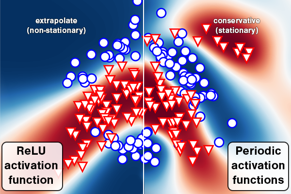
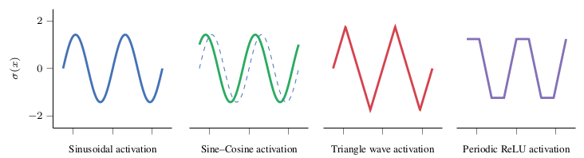

# Periodic Activation Functions Induce Stationarity

This repository is the official implementation of the methods in the publication:

L. Meronen, M. Trapp, and A. Solin (2021). **Periodic Activation Functions Induce Stationarity**. *To appear at Advances in Neural Information Processing Systems (NeurIPS)*.



The paper's main result shows that periodic activation functions in Bayesian neural networks establish a direct connection between the prior on the network weights and the spectral density of the induced stationary (translation-invariant) Gaussian process prior. Moreover, this link goes beyond sinusoidal (Fourier) activations and also covers periodic functions such as the triangular wave and a novel periodic ReLU activation function. Thus, periodic activation functions induce conservative behaviour into Bayesian neural networks and allow principled prior specification.

The figure below illustates the different periodic activation discussed in our work.


The following Jupyter [notebook](notebook/PeriodicActivationFunctions.ipynb) illustrates the approach on a 1D toy regression data set.

## Supplemental material
Structure of the supplemental material folder:

* `data` contains UCI and toy data sets
* `notebook` contains a Jupyter notebook in Julia illustrating the proposed approach
* `python_codes` contains Python codes implementing the approach in the paper using KFAC Laplace approximation and SWAG as approximate inference methods
* `julia_codes` contains Julia codes implementing the proposed approach using dynamic HMC as approximate inference method

## Python code requirements and usage instructions

Installing dependencies (recommended Python version 3.7.3 and pip version 20.1.1):
```bash
pip install -r requirements.txt
```

Alternatively, using a conda environment:
```bash
conda create -n periodicBNN python=3.7.3 pip=20.1.1
conda activate periodicBNN
pip install -r requirements.txt
```

### Pretrained CIFAR-10 model

If you wish to run the OOD detection experiment on CIFAR-10, CIFAR-100 and SVHN images, the pretrained GoogLeNet model that we used can be obtained from: https://github.com/huyvnphan/PyTorch_CIFAR10. The model file should be placed in path `./state_dicts/updated_googlenet.pt`

### Running experiments

To running all Python experiments, first navigate to the following folder `python_codes/` inside the supplement folder on the terminal.

#### Running UCI experiments:

Train and test the model:
```bash
python traintest_KFAC_uci.py 0 boston
```

where the first command line argument is the model setup index and the second one is the data set name. See the setups that different indexes use from the list below. To start multiple jobs for different setups running in parallel, you can create a shell script or use slurm. An example of such a script is shown here:
```bash
#!/bin/bash
for i in {0..3}
do
  python traintest_KFAC_uci.py $i 'boston' &
done
```

After calculating results for the models, you can create a LaTeX table of the results using the script `make_ucireg_tables.py` for regression results and using `make_uci_tables.py` for classification results. An example command of both of these python scripts are shown below:
```bash
python make_ucireg_tables.py full > ./table_name.tex
python make_uci_tables.py full NLPD_ACC > ./table_name.tex
```

The first argument is either `full` or `short` and determines whether the generated table contains entries for all possible models or only for a subset. The second argument in the classification script determines whether the script computes AUC numbers (use `AUC` as the argument) or both NLPD and accuracy numbers (use `NLPD_ACC` as the argument). The last argument defines the output path for saving the table.

#### Running the MNIST experiment:

Train the model:
```bash
python train_KFAC_mnist.py 0
```
where the first command line argument is the model setup index. See the setups that different indexes use from the list below.

Test the model:
```bash
python test_KFAC_mnist.py 0 standard
python test_KFAC_mnist.py 0 rotated 0
```

where the first command line argument is the model setup index. See the setups that different indexes use from the end of this file. The second command line argument (`standard` or `rotated`) selects the type of MNIST test set. If the second command line argument is `rotated`, then the third command line argument is needed to select the test rotation angle (0 to 35 corresponding to rotation angles 10 to 360). Here you can again utilize a shell script or use slurm for example to run different rotation angles in parallel:
```bash
#!/bin/bash
for i in {0..35}
do
  python test_KFAC_mnist.py 0 rotated $i &
done
```

After calculating some results, you can use `visualize_MNIST_metrics.py` for plotting the results. The usage for this file is as follows:
```bash
python visualize_MNIST_metrics.py
```
On line 22 of this file (`setup_ind_list = [0,1,2,10]`) you can define which setups are included into the plot. See the setups that different indexes use from the list below.

#### Running the CIFAR-10 OOD detection experiment:

Train the model:
```bash
python train_SWAG_cifar.py 0
```
where the first command line argument is the model setup index. See the setups that different indexes use from the list below.

Test the model:
```bash
python test_SWAG_cifar.py 0 CIFAR10_100
```
where the first command line argument is the model setup index. See the setups that different indexes use from the end of this file. The second command line argument is the OOD data set to test on, ether `CIFAR10_100` or `CIFAR_SVHN`.

After calculating some results, you can use `visualize_CIFAR_uncertainty.py` for plotting the results, and `calculate_CIFAR_AUC_AUPR.py` for calculating AUC and AUPR numbers. The usage for these files is as follows:
```bash
python visualize_CIFAR_uncertainty.py 0
python calculate_CIFAR_AUC_AUPR.py 0
```
where the first command line argument is the model setup index. See the setups that different indexes use from the list below.

#### Model setups corresponding to different model setup indexes
```
0: ReLU
1: local stationary RBF
2: global stationary RBF (sinusoidal)
3: global stationary RBF (triangle)
4: local stationary matern52
5: global stationary matern52 (sinusoidal)
6: global stationary matern52 (triangle)
7: local stationary matern32
8: global stationary matern32 (sinusoidal)
9: global stationary matern32 (triangle)
10: global stationary RBF (sincos)
11: global stationary matern52 (sincos)
12: global stationary matern32 (sincos)
13: global stationary RBF (prelu)
14: global stationary matern52 (prelu)
15: global stationary matern32 (prelu)
```

#### Creating your own task specific model using our implementation of periodic activation functions
If you wish to make your own model using a specific feature extractor network of your choice, you need to add it into the file `python_codes/model.py`. New models can be added at the bottom of the file among the already implemented ones, such as:
```python
class my_model:
    base = MLP
    args = list()
    kwargs = dict()
    kwargs['K'] = 1000
    kwargs['pipeline'] = MY_OWN_PIPELINE
```

Here you can name your new model and choose some keyword arguments to be used. `kwargs['pipeline']` determines which feature extractor your model is using, and it is a mandatory keyword argument. You can create your own feature extractor. As an example here we show the feature extractor for the MNIST model:
```python
class MNIST_PIPELINE(nn.Module):

    def __init__(self, D = 5, dropout = 0.25):
        super(MNIST_PIPELINE, self).__init__()

        self.O = 25
        self.conv1 = nn.Conv2d(1, 32, 3, 1)
        self.conv2 = nn.Conv2d(32, 64, 3, 1)
        self.dropout = nn.Dropout(dropout)
        self.linear = nn.Linear(9216, self.O)        

    def forward(self, x):

        x = self.conv1(x)
        x = F.relu(x)
        x = self.conv2(x)
        x = F.relu(x)
        x = F.max_pool2d(x, 2)
        x = self.dropout(x)
        x = torch.flatten(x, 1)
        
        #Additional bottleneck
        x = self.linear(x)
        x = F.relu(x)
        
        return x
```

#### Using our model for different data sets
If you wish to use our model for some other data set, you need to add the data set into the file `python_codes/dataset_maker.py`. There you need to configure your data set under the `load_dataset(name, datapath, seed):` function as an alternative `elif:` option. The implementation of the data set must specify the following variables: `train_set, test_set, num_classes, D`. After adding the data set here, you can use it through the model training and evaluation scripts.

## Julia code requirements and usage instructions
Make sure you have Julia installed on your system. If you do not have Julia, download it from https://julialang.org/downloads/.

To install the necessary dependencies for the Julia codes, run the following commands on the command line from the respective julia codes folder: 

```bash
julia --project=. -e "using Pkg; Pkg.instantiate();"
```

### Running the experiment on the banana data set

Run the following commands on the command line: 
```bash
julia --project=. banana.jl [--nsamples NSAMPLES] [--nadapts NADAPTS] [--K K]
                 [--kernel KERNEL] [--seed SEED] [--nu NU] [--ell ELL]
                 [--ad AD] [--activation ACTIVATION] [--hideprogress]
                 [--subsample SUBSAMPLE]
                 [--subsampleseed SUBSAMPLESEED] [datapath] [outputpath]
```

Example to obtain 1000 samples using dynamic HMC for an BNN with 10 hidden units and priors equivalent to an RBF kernel: 
```bash
julia --project=. banana.jl --nsamples 1000 --K 10 --kernel RBF --ad reverse ../data ./
```

After a short while, you will see a progress bar showing the sampling progress and an output showing the setup of the run. For example:
```
(K, n_samples, n_adapts, kernelstr, ad, seed, datapath, outputpath) = (10, 1000, 1000, "RBF_SinActivation", gradient_logjoint, 2021, "../data", "./")
```
Depending on the configuration, the sampling might result in divergencies of dynamic HMC shown as warnings, those samples will be discarded automatically.
Once the sampling is finished, you will see statistics on the sampling alongside with the `UID` and the `kernel string`. Both are used to identify the results for plotting.

To visualise the results, use the `banana_plot.jl` script, i.e.,
```bash
julia --project=. banana_plot.jl [datapath] [resultspath] [uid] [kernelstring]
```

For example, to visualise the results calculated above (replace `8309399884939560691` with the uid shown in your run!), use:
```bash
julia --project=. banana_plot.jl ../data ./ 8309399884939560691 RBF_SinActivation
```

The resulting visualisation will automatically be saved as a pdf in the current folder!

### Notebook
The notebook can be run locally using:
```bash
julia --project -e 'using Pkg; Pkg.instantiate(); using IJulia; notebook(dir=pwd())'
```


## Citation
If you use the code in this repository for your research, please cite the paper as follows:
```bibtex
@inproceedings{meronen2021,
  title={Periodic Activation Functions Induce Stationarity},
  author={Meronen, Lassi and Trapp, Martin and Solin, Arno},
  booktitle = {Advances in Neural Information Processing Systems (NeurIPS)},
  year={2021}
}
```

## Contributing

For all correspondence, please contact lassi.meronen@aalto.fi.

## License

This software is provided under the [MIT license](LICENSE).

